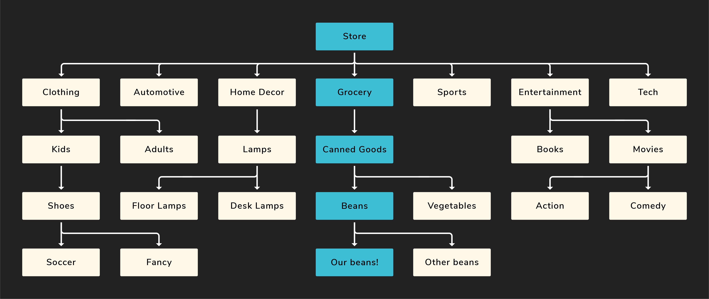
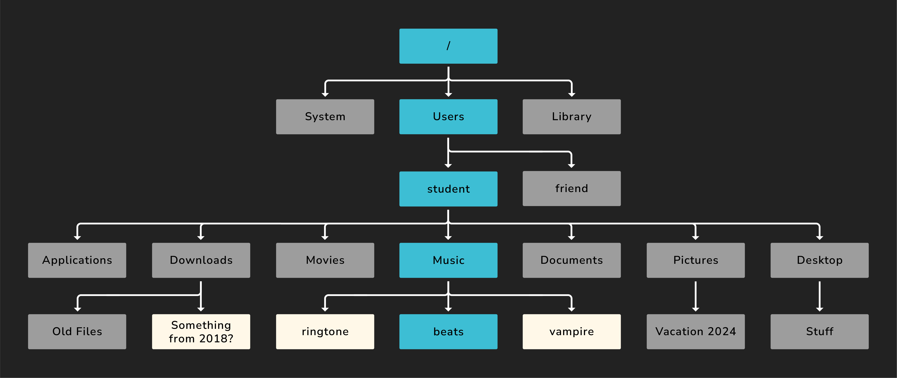

<h1>
  <span class="headline">Intro to the CLI</span>
  <span class="subhead">The File System</span>
</h1>

**Learning objective:** By the end of this lesson, students will be able to analyze and categorize key components of a computer's file system, including root and home directories, and explain their significance using real-world analogies.

## What is the file system?

Before navigating the file system, we should understand what it is. The file system is the organizational structure of a computer.

Just like products in a store are grouped into categories, divided into sections, and arranged on shelves, the files on a computer are organized into directories (also known as folders in a GUI).

Imagine you are trying to find a can of beans in a store. You would start at the entrance, head to the grocery section, find the canned goods aisle, locate the shelf for beans, and then choose the specific kind you want.

Suppose we visualized this:


There is a clear path to our can of beans! What if we added more areas of the store?



The path from the store entrance to our specific can of beans is still highlighted, but now we can also see other departments.

So what does this have to do with a file system?

A file system on a computer works in a very similar way. Imagine you’re looking for music you recorded on your computer.

You would start in the _root_ directory – `/`. This directory contains all other files and folders. It's like the store itself. Next, you'd go into the `Users` directory. From there, you’d open your specific user folder (this is your _home_ directory). Finally, you’d go into your `Music` directory to find your files.

Here’s a visual example:


This shows the path to the `beats` file. The word _path_ refers to the exact location of a file or folder in the system. The _absolute path_ to the `beats` file is:

```plaintext
/Users/student/Music/beats
```

> 📚 The _root_ directory is represented by a single forward slash (`/`) on Unix-based systems. It’s the top-level directory — everything starts from here.
>
> The _home_ directory is the personal space for a user on the system. It stores your documents, downloads, settings, and more. There's also a shortcut for the home directory: `~`.
>
> The _absolute path_ is the full path to a file or folder, starting from the root directory.

We'll see more examples of paths later.

Back to our store example: just as departments, aisles, and shelves help organize products like beans, directories help us organize files. Directories don’t do much on their own — their job is to hold other files and folders in a way that makes sense to us.

Of course, the computer won’t stop you from organizing your files badly. If you wanted to dump everything you ever made onto your desktop, you could (but please don’t).

Just like our store has more than one product, your file system has more than one file.



The path from the root to the `beats` file is still highlighted, but we’ve added other common directories and files. The gray folders are not part of the path to `beats`, and the white icons represent individual files.

Most directories would contain something (though they don’t have to), but we’ve kept it simple here.

Let’s build some shared vocabulary using this diagram. Take the `student` directory, for example:

- The `student` directory has many _children_, like `Applications`, `Downloads`, and `Movies`.
- It has one _parent_: `Users`. Every file or folder has exactly one parent.

One final note before we move on: directories can contain both other directories and individual files — as you can see in the `Downloads` folder above.
